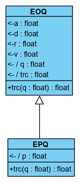
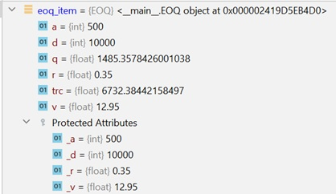
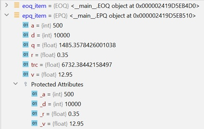

  
```{r setup, include=FALSE}
knitr::opts_chunk$set(echo = TRUE)

suppressMessages(library(reticulate))
```

In this tutorial, we're going to look at a number of important OOP topics:

- Inheritance
- Polymorphism
- Operator overloading
- Functions are objects (passing functions as parameters).

Note: In most of the coding examples, I have intentionally omitted docstrings, just to keep the code compact. *ALL* of your functions, classes, and methods should provide docstrings.


## Inheritance

Last week, we began our discussion of object-oriented programming (OOP) in Python. We introduced the concepts of classes and objects, attributes and methods, properties, and encapsulation. Additionally, through our "balls" examples, we conceptually covered the concept of *inheritance* which, along with the related concepts of polymorphism and encapsulation, provides many of the benefits realizable through OOP implementations.

### What is Inheritence?

Just like you inherited certain characteristics from your parents (e.g., hair and eye color, etc.), classes can inherit the characteristics of *base (or parent) classes*. Last week we talked about the *gen-spec* (or *is-a*) relationship. The class diagram below illustrates a gen-spec.


```{r echo=FALSE, out.width = "15%", fig.align = "center"}


```

The *base* or *parent* class in this gen-spec is our EOQ class from earlier in this tutorial. The EPQ class is the *child* or *derived* class. We say that EPQ *specializes* or *inherits* EOQ, and that EOQ is the *generalization*. Yeah I know, lots of buzz words...

So what, *exactly*, does it mean when we say EPQ inherits EOQ:

- EPQ inherits *all* of EOQ's attributes
- EPQ inherits *all* of EOQ's methods
- EPQ inherits *all* of EOQ's base classes.

We also say that EPQ *is-a* EOQ, meaning that an instance of EPQ is considered to be both an EPQ and an EOQ, in the same way that our SoccerBall example from last week was both a SoccerBall and a Ball.

### A trivial child class

Let's start by defining EOQ and EOQException classes:

```{python}

class EOQException(Exception):

    def __init__(self, D, A, v, r):
        super().__init__()
        self.D = D
        self.A = A
        self.v = v
        self.r = r

    def __str__(self):
        msg = f'One or more of the calling arguments was invalid:\n{self.D=}\n{self.A=}\n{self.v=}\n{self.r=}\n{super().__str__()}'
        return msg


```

In our new exception's constructor, we first call the base class (Exception) constructor, and then assign the values of the calling arguments (EOQ's parameters) to internal variables so that we can evaluate them in the exception. We've also defined an *str* method to make our exception output a little nicer.

Next, we'll define a new EOQ class. This class prevents the construction of invalid EOQ instances by raising an EOQException if a constuctor argument is invalid.

```{python}
import math
from numbers import Number

class EOQ:
    """
    State preserving economic order quantity (EOQ) class. The EOQ is the cost-minimizing order
    quantity under the following assumptions:
        - Demand is deterministic, constant, and stationary
        - Inventory related costs consist of a holding cost per unit (assessed on average inventory) and an
        - aggregate order placement cost (i.e., a flat fee to place an order regardless of the quantity ordered).
    """

    def __init__(self, d: int|float, a: int|float, v: int|float, r: float):
        """
        Creates an Economic Order Quantity (EOQ) object.
        :param d: Demand in units (usually annual demand)
        :type d: float
        :param a: Aggregate order placement cost.
        :type a: float
        :param v: unit acquisition cost (same currency units as order placement cost)
        :type v: float
        :param r: unit holding cost percentage rate (time units must match demand time units, e.g. annual)
        :type r: float

        Raises an EOQException if any of D, A, v, and r are invalid (i.e., non-numeric or
        non-positive).
        """

        # validate arguments. d, a, v, and r must all be numeric and positive
        args = [d, a, v, r]

        # create boolean list of argument validity
        test = [isinstance(a, Number) and a > 0 for a in args]

        if all(test):
            # all arguments are valid, so we can calculate the EOQ, so save private attributes

            self._d = d
            self._a = a
            self._v = v
            self._r = r

        else:
            # At least one calling argument was non-numeric or non-positive, so return None indicating that no
            # result could be calculated.
            raise EOQException(d, a, v, r)


    @property
    def d(self):
        return self._d

    @property
    def a(self):
        return self._a

    @property
    def v(self):
        return self._v

    @property
    def r(self):
        return self._r

    @property
    def q(self):
        """
        Calculates the EOQ for the object's normal state: D, A, v, and r.

        Returns:
            (float): Economic order quantity
        """

        return math.sqrt(2 * self.d * self.a / (self.v * self.r))

    @property
    def trc(self):
        """
        Calculates Total Relevant Cost corresponding to the EOQ, i.e., TRC(Q*), for the object.

        Returns:
            (float): Total relevant cost (TRC) for the object's normal state.
        """

        return math.sqrt(2 * self.d * self.a * self.v * self.r)

    def trc_q(self, q: int|float=None):
        """
        Calculates the total relevant cost (TRC) for quantity q. If no q is specified,
        returns TRC(Q*).
        
        Args:
            q (int|float):

        Returns:
            (float): Total relevant cost of q.
            None: if q is non-numeric or non-positive.
        """
        
        if q is None:
            return self.trc
        
        if isinstance(q, Number) and q > 0:
            # q is valid, so use the general form of the TRC to calculate for q
            return q * self.v * self.r / 2 + self.d * self.a / q
        else:
            # q is invalid
            return None

```

Finally, we define EPQ as a child class of EOQ. We won't add *any* new attributes or methods to the new child class:

```{python}

class EPQ(EOQ):
  pass
```

In the definition above, we added the *pass* statement as the class definition body, because we want to strictly show what EPQ can do with only what it inherits from EOQ. The example below compares EOQ to EPQ; don't worry about the Pandas code in the example, it's just used to create a nice comparison table. We'll cover Pandas after Fall Break.

```{python}
import pandas as pd

eoq_item = EOQ(10000, 500, 12.95, 0.35)
epq_item = EPQ(10000, 500, 12.95, 0.35)

rows = [{'q*':x.q, 'trc(q*)': x.trc, 'trc(500)': x.trc_q(500)} for x in [eoq_item, epq_item]]
print(rows)

table = pd.DataFrame(rows)
table.index=['EOQ', 'EPQ']
print(table)
```

From the table above, we see that the EOQ and EPQ objects *seem* to behave identically; they both provided:

- Constructors that accepted the four arguments, D, A, v, r
- q and trc properties
- A trc_q method
- Identical values in all cases.


```{r fig_eog_epq_debug, echo=FALSE, out.width='40%', fig.cap="Debug information (Left: EOQ, Right: EPQ)", fig.show="hold", fig.align='center', fig.subcap=c("EOQ", "EPQ"), fig.asp=1, fig.ncol=2}




```

Using the debugger, we see that both EOQ and EPQ instances have exactly the same attributes, *even though we added no code to the EPQ specialization*.

Now, let's modify the specialization to calculate like an actual EPQ:

- Accept additional parameter, p, the annual production rate
- Calculate q, trc, and trc_q for the EPQ model:

$$Q^* = \sqrt{\frac{2DA}{vr}}\sqrt{\frac{p}{p-D}}$$
$$TRC(Q^*) = \sqrt{2DAvr}\sqrt{\frac{p-D}{p}}$$

$$TRC(Q) = \frac{Q}{2}\bigg(\frac{p-D}{p}\bigg)vr + \frac{DA}{Q}$$
Note that all of these can be stated in terms of *adjusted* EOQ calculations:

$$Q^*_{EPQ} = Q^*_{EOQ} \sqrt{\frac{p}{p-D}}$$
$$TRC_{EPQ}(Q^*) = TRC_{EOQ}(Q^*) \sqrt{\frac{p-D}{p}}$$
and

$$TRC_{EPQ}(Q) = TRC_{EOQ}(Q) - \frac{D}{p}\frac{Q}{2}vr$$
Now let's modify our EPQ class to save the production rate $p$, and adjust the EOQ calculations as shown above:

- Create an EPQException class, derived from EOQException, that adds the production rate $p$
- Add a constructor that
  - Invokes the base class (EOQ) constructor
  - Validates $p$ (raises exception if $p$ invalid, stores $p$ otherwise)
  - *Overrides* the derived properties q and trc
  - *Overrides* the trc(q) method.
  
Note that wherever possible, we leverage the EOQ class, thereby avoiding code duplication (the EOQ calculations are the same whether they're in the EOQ or EPQ classes).

```{python}

class EPQException(EOQException):

    def __init__(self, d, a, v, r, p):
        super().__init__(d, a, v, r)
        self.p = p

    def __str__(self):
        return super().__str__() + f'{self.p=}'

class EPQ(EOQ):

    def __init__(self, d: float, a: float, v: float, r: float, p: float):

        # invoke the base class' constructor, to ensure that we have a valid object
        # this will save the values of d, a, v, and r. This step makes sure that our
        # EPQ object is also a valid EOQ object.

        super().__init__(d, a, v, r)

        # now we'll add P
        if isinstance(p, Number) and p > self.d:
            self._p = p
        else:
            raise EPQException(d, a, v, r, p)

    @property
    def p(self):
        return self._p

    @property
    def q(self):
        # Return EOQ quantity adjusted for EPQ (gradual inventory buildup)
        return super().q * math.sqrt(self.p / (self.p - self.d))

    @property
    def trc(self):
        # return the EOQ TRC* adjusted for EPQ (graduate inventory buildup)
        return super().trc * math.sqrt((self.p-self.d) / self.p)

    def trc_q(self, q: int|float=None):
        # return the EOQ TRC adjusted for EPQ (graduate inventory buildup)
        return super().trc_q(q) - q/2 * (self.d / self.p) * self.v * self.r

  
eoq_item = EOQ(10000, 500, 12.95, 0.35)
epq_item = EPQ(10000, 500, 12.95, 0.35, 15000)

rows = [{'q*':x.q, 'trc(q*)': x.trc, 'trc(500)': x.trc_q(500)} for x in [eoq_item, epq_item]]

table = pd.DataFrame(rows)
table.index=['EOQ', 'EPQ']
print(table)

```

And there you have it. Our EPQ class now does true EPQ calculations by inheriting EOQ, leveraging the work already performed by EOQ, and adding the minimum code necessary.

## Polymorphism

Polymorphism is a fancy way of saying that *an object knows what type of object it is, and behaves appropriately*. For example, our epq_item knows that it is an EPQ and therefore, when epq_item.q is requested, the object executes the q property defined in the EPQ class. It does this even though the q property inherited from EOQ is still available (and can be used as demonstrated by the code in EPQ::q). On the other hand, when epq_item.d is requested, the EPQ object knows that it is also an EOQ object, and since it doesn't have its own d property, it executes the d property defined in EOQ. 

So how does polymorphism actually work? When an attribute, property, or method is requested from an object, Python first looks to see if that method is defined in the object's class (e.g., EPQ for epq_item). If the attribute, property, or method is found, it is used. However, if it is not found, then Python begins searching *up* the inheritance tree. In other words, it looks at the object's parent class. If the attribute, property, or method exists there, it uses it. If it isn't found, then it looks at *that* object's base class, etc. If it searches all the way up the inheritance tree and can't find the requested attribute, property, or method, then it will raise an exception.

### Python's Polymorphism vs True Polymorphism

In strict object oriented languages like Java and C++, in order for a SoccerBall to be treated as a *ball*, it must be derived from a Ball base class. This is a consequence of strict typing rules imposed by the language.

Python, on the other hand, is very lenient from a typing perspective. In many Python applications, as long as an object exposes the attributes, properties, and methods we expect, we're happy. Python won't care if SoccerBall is actually derived from Ball, as long as it provides the same properties and methods with the same call signature. This is referred to as *duck typing* (i.e., if it looks, walks, and quacks like a duck, it's a duck, or close enough not to matter...). 

Whether traditional inheritance trees or duck typing is best will depend on the application. There are advantages and disadvantages to each and we discuss these, from a conceptual standpoint, in the Object-oriented Analysis and Design course (BUS 469/554).

## Operator overloading

Observe the following code:

```{python}
s1 = 'This is a string.'
s2 = 'And so is this.'

print(s1 + " " + s2)
```

Notice that our print statement *added* s1 and s2 (along with a space). How did it do that? Strings aren't numbers, so how can we add them?

The answer is operator overloading. Python allows you to overload just about any operator (e.g., +, <=, etc.) for the classes you define. To overload an operator, we implement the *dunder* method for that operator when we define the class. To illustrate, let's implement the $>$ operator in our EOQ class. What would make sense for this operator? Should we compare quantities? Should we compare TRCs? We could do either. We could even do both (i.e. compare q's and trc's), but that probably doesn't make sense, so for the sake of this example, we'll choose to compare quantities.

The dunder method corresponding to $>$ is __gt__. The following code shows the new __gt__ method immediately below the constructor.

```{python}

class EOQ:
    """
    State preserving economic order quantity (EOQ) class. The EOQ is the cost-minimizing order
    quantity under the following assumptions:
        - Demand is deterministic, constant, and stationary
        - Inventory related costs consist of a holding cost per unit (assessed on average inventory) and an
        - aggregate order placement cost (i.e., a flat fee to place an order regardless of the quantity ordered).
    """

    def __init__(self, d: int|float, a: int|float, v: int|float, r: float):
        """
        Creates an Economic Order Quantity (EOQ) object.
        :param d: Demand in units (usually annual demand)
        :type d: float
        :param a: Aggregate order placement cost.
        :type a: float
        :param v: unit acquisition cost (same currency units as order placement cost)
        :type v: float
        :param r: unit holding cost percentage rate (time units must match demand time units, e.g. annual)
        :type r: float

        Raises an EOQException if any of D, A, v, and r are invalid (i.e., non-numeric or
        non-positive).
        """

        # validate arguments. d, a, v, and r must all be numeric and positive
        args = [d, a, v, r]

        # create boolean list of argument validity
        test = [isinstance(a, Number) and a > 0 for a in args]

        if all(test):
            # all arguments are valid, so we can calculate the EOQ, so save private attributes

            self._d = d
            self._a = a
            self._v = v
            self._r = r

        else:
            # At least one calling argument was non-numeric or non-positive, so return None indicating that no
            # result could be calculated.
            raise EOQException(d, a, v, r)


    def __gt__(self, other):
        if self.q > other.q:
            return True
        else:
            return False

    @property
    def d(self):
        return self._d

    @property
    def a(self):
        return self._a

    @property
    def v(self):
        return self._v

    @property
    def r(self):
        return self._r

    @property
    def q(self):
        """
        Calculates the EOQ for the object's normal state: D, A, v, and r.

        Returns:
            (float): Economic order quantity
        """

        return math.sqrt(2 * self.d * self.a / (self.v * self.r))

    @property
    def trc(self):
        """
        Calculates Total Relevant Cost corresponding to the EOQ, i.e., TRC(Q*), for the object.

        Returns:
            (float): Total relevant cost (TRC) for the object's normal state.
        """

        return math.sqrt(2 * self.d * self.a * self.v * self.r)

    def trc_q(self, q: int|float=None):
        """
        Calculates the total relevant cost (TRC) for quantity q. If no q is specified,
        returns TRC(Q*).
        
        Args:
            q (int|float):

        Returns:
            (float): Total relevant cost of q.
            None: if q is non-numeric or non-positive.
        """
        
        if q is None:
            return self.trc
        
        if isinstance(q, Number) and q > 0:
            # q is valid, so use the general form of the TRC to calculate for q
            return q * self.v * self.r / 2 + self.d * self.a / q
        else:
            # q is invalid
            return None


eoq_item = EOQ(10000, 500, 12.95, 0.35)
epq_item = EPQ(10000, 500, 12.95, 0.35, 15000)

print(eoq_item > epq_item)

```

```{python, echo=FALSE}
eoq_q = round(eoq_item.q, 2)
epq_q = round(epq_item.q, 2)
```

```{r, echo=FALSE}
eoq_q<-py$eoq_q
epq_q<-py$epq_q
```


Recall from an earlier example that $Q^*_{EOQ} \approx `r eoq_q`$ and $Q^*_{EPQ} \approx `r epq_q`$, so our $>$ operator worked! Of course, we'd have a problem if we tried to use any other operators at this point, because we haven't yet defined them. However, this example illustrates how we overload operators.

You can find a complete list of dunder methods available for overloading, including the arithmetic and comparison operators, [here](https://www.pythonmorsels.com/every-dunder-method/).

## Functions are objects (passing functions as parameters)

A common statement you'll hear/read when learning Python is, "Everything is an object in Python". We've discussed this with respect to variables. Recall our discussion about the Python memory model and how it handles immutable variables like ints. And it seems pretty clear that instances of classes are objects (we even call them objects). However, what may not be as clear to you is that *functions are objects too*. That means you can do anything with a function that you can with any Python object.

One of the primary uses for this is passing a function as a calling argument to another function. For example, let's say we wanted to create a function that would calculate lead time demand (i.e., demand over a lead time), assuming that both demand and lead time are random variables. For each trial, we need to take a random value for daily demand and multiply it by the random lead time.

We could do something like the following, assuming that lead time is Poisson with mean 5 and demand is normally distributed with mean and standard deviation 100 and 20 respectively:

```{python}
from scipy.stats import poisson
from scipy.stats import norm

def lt_dmd(n: int):
    lt = poisson.rvs(5, size=n )
    dly = norm.rvs(100, 20, size=n)
    
    # scipy.stats methods return NumPy arrays, so we can
    # do vector math on the results. We'll learn about NumPy
    # after Fall Break
    
    ltd = lt * dly
    return ltd

print(lt_dmd(100))

```

Now the above works, but it's not very flexible. What if we want to change one or both of the distributions? What if we want to use different distribution parameters?

Passing functions as calling arguments is the answer. Compare the above to the following:

```{python}

dmd_dist = norm(100, 20)
lt_dist = poisson(5)

def lt_dmd(n, ldist, ddist):
  
  lt = ldist(size=n)
  dly = ddist(size=n)
  
  ltd = lt * dly
  return ltd

print(lt_dmd(100, lt_dist.rvs, dmd_dist.rvs))
```

In the code above, we created two *distribution objects*, lt_dist and dmd_dist. These distribution objects provide a random number generating method named rvs. We then called the lt_dmd function, passing the rvs methods for both lt_dist and dmd_dist.

Note in the call to lt_dmd, we pass lt.rvs, *not* lt.rvs(). When we follow a function/method name with parentheses, we are *invoking* the method (i.e., calling it). However, when we reference the function/method by name without the parentheses, we are simply referring to the function object; think of a function object as an object that contains executable Python code.

And now we can use our lt_dmd function with entirely different distributions; no changes to the lt_dmd function are required.

```{python}
from scipy.stats import expon

print(lt_dmd(100, expon(1/5).rvs, norm(45, 5).rvs))

```

Designing functions to accept functions to be used internally can dramatically increase the flexibility/reusability of the function.

