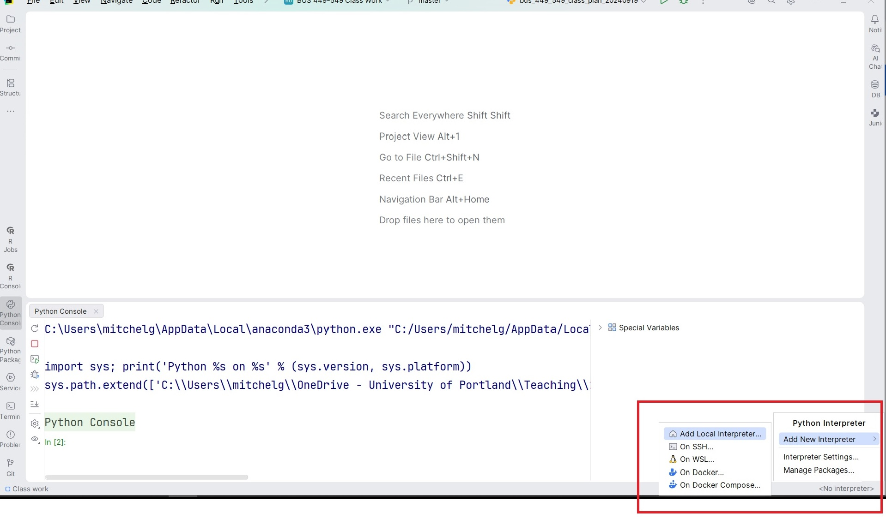
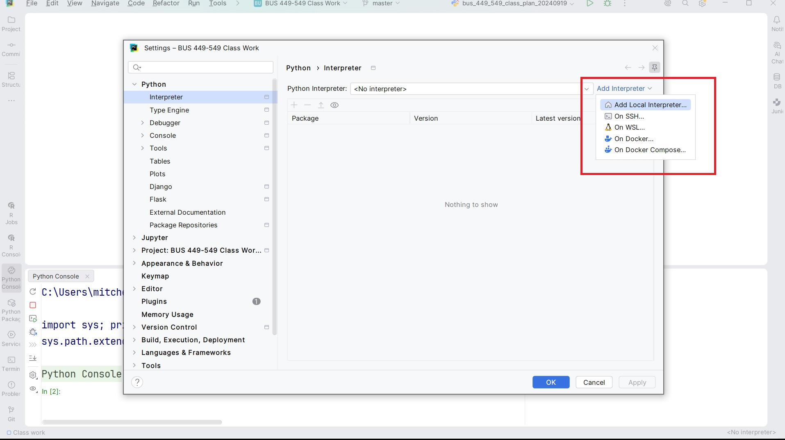
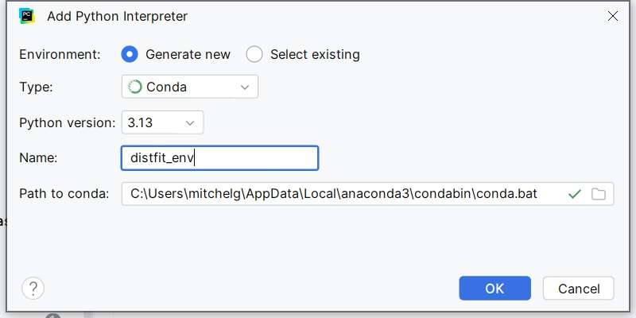

```{r setup, include=FALSE}
knitr::opts_chunk$set(echo = TRUE)
suppressMessages(require(kableExtra))
suppressMessages(require(reticulate))
```

This tutorial focuses primarily on installing and using the distfit package for fitting distributions.

Here's the description from the distfit [project web site](https://pypi.org/project/distfit/):

> distfit is a Python package for probability density fitting of univariate distributions for random variables. The distfit library can determine the best fit for over 90 theoretical distributions. The goodness-of-fit test is used to score for the best fit and after finding the best-fitted theoretical distribution, the loc, scale, and arg parameters are returned. It can be used for parametric, non-parametric, and discrete distributions.

## Installation

Installation can be done in two ways:

- command line/terminal window install
- PyCharm IDE install.

### Command line/Terminal window install

The installation *should* be straightforward. The following are typical instructions for a Windows command line installation:

1. Open your Windows command window (terminal window on a Mac)

2. Execute the following commands at the prompt:

```cmd
conda create -n distfit-env python=3.14
conda activate distfit-env

conda install conda-forge::distfit

```

Here's the breakdown:

- The first statement creates a new conda virtual environment. This process can take a while...
- The second statement activates the environment so the subsequent install will be specific to the new virtual environment
- The third statement uses the conda package manager to install distfit in the new virtual environment. The install can also be time consuming.

New conda virtual environments do not have the packages we typically use pre-installed (e.g., NumPy). The install of distfit will install some of these (e.g., Matplotlib, NumPy, Pandas, SciPy), but you may have to install any additional packages you expect to use.

### PyCharm Installation

You can create a new virtual environment and install distfit using PyCharm. To do so:

- Create a new conda virtual environment
- Install distfit into the environment.

#### Create a conda virtual environment in PyCharm

The first step is to create a new conda virtual environment for using distfit. You can initiate this in two ways. 

```{r, echo=FALSE, out.width="100%", fig.align="center", fig.cap="Adding Local Interpreter via status bar"}

```

&nbsp;

```{r, echo=FALSE, out.width="100%", fig.align="center", fig.cap="Adding Local Interpreter via settings"}

```

&nbsp;

Either method will load an "Add Python Interpreter" dialog (see below).

```{r, echo=FALSE, out.width="75%", fig.align="center", fig.cap="Creating New Conda Environment"}

```

&nbsp;

In the dialog, specify (as shown):

- Environment: Generate new
- Type: Conda
- Python versions: 3.13 (or higher depending on your Conda install)

The *Path to conda* control should already point to your conda install. If it does not, you'll have to supply this as well.

When you click OK, PyCharm will launch the creation of a new conda environment. This will take some time, so you might want to plan to have something else to do while it works.

## Using distfit

distfit is very easy to use. It will:

- fit the supplied data on up to 89 SciPy distributions
- calculate a residual sum of squares (RSS) score for each
- rank the distributions by RSS (smaller is better)
- select the best fit as determined by smallest RSS.

A couple of caveats when using distfit, or *any*, distribution fitting package/function:

- The resulting fit is not guaranteed to be against the actual source distribution (i.e., the data may actually come from an exponential but distfit finds the best fit for a Pareto distribution)
- distfit is primarily for use fitting continuous distributions (for discrete distributions, it only fits binomial distributions).

distfit was created so that it could be utilized within a SciPy pipeline. As such, it the following methods, consistent with SciPy convention:

- fit
- transform
- fit_transform 

For our purposes in this course, we really only need to use the fit_transform method.

### Distribution fitting example

Assume that we have collected lead time data from 10,000 orders. The following shows the frequency distribution for the lead time data:

```{python, echo=FALSE}
import scipy.stats as stats
import matplotlib.pyplot as plt
import numpy as np
import pandas as pd

# shifted exponential, min 2, mean 7. mu is the mean of the random portion.
a = 2
mu = 5
n = 10000

ltdist = stats.expon(loc=a, scale=mu)
lt_data = ltdist.rvs(size=n)

fig, ax = plt.subplots()
ax.hist(lt_data, bins=60, density=False)

ax.set_ylabel('Frequency')
ax.set_xlabel('lt')

plt.show()

```

To fit the data to a continuous distribution, we instantiate a distfit object and call fit_transform:

```{python}
from distfit import distfit

dist = distfit()
rslt = dist.fit_transform(lt_data)

```

First, let's look at the *best fit* model:

```{python}
dist.plot()
plt.show()

```

Here we see the selected model's probability density function plotted against the distribution (density) of the lead time data. It looks like a nice fit.

We can see the distributions that distfit evaluated and how they scored by printing a summary plot:

```{python}
dist.plot_summary()
plt.show()
```

Let's see what *rslt* contains:

```{python}
for k in rslt.keys():
  print(f'{k}')

```

Clearly, there's a lot to digest. Here's the *model* value from the rslt object:

```{python}
print(rslt['model'])

```

Note the model is also a dictionary, one of whose elements is called *model* as well. This *nested* model is a frozen distribution object for the *best fit* model:

```{python}
fitted_dist = rslt['model']['model']
print(f'{fitted_dist.mean()=}')
print(f'{fitted_dist.cdf(4)=}')

```

The *summary* also contains valuable info for us to process:

```{python}
pd.set_option('display.max_columns', None)
pd.set_option('display.width', 210)
print(rslt['summary'][['name', 'score', 'loc', 'scale', 'arg']])
```

First, note that the *arg* column contains any distribution parameters required in addition to *loc* and *scale*.

Second, it's clear there is a *very* small performance difference between the more complex gamma distribution and the single parameter exponential distribution. We see this on the best fit graph as well as in the score column of the summary table. With such a small difference, I'd probably opt for the simpler exponential distribution which shows an acceptably small RSS. 

Note that in this case, we *know* the lead time data is exponentially distributted, but distfit decided that a gamma distribution better fit the data. This is clearly do to the specific random values in the dataset used to fit the distribution. Perhaps with more observations (10,000 is already a lot) distfit would have correctly identified the data as belonging to an exponential distribution. Examples like this show why we can't get too hung up on strictly using the *best fit* model...

Looking at its DataFrame info, we see that the summary DataFrame contains the score, parameters, and *model* for each of the evaluated distributions. It turns out that the *model* is a frozen distribution object. So, the rslt contains the model for the *best fit* distribution, and the summary table contains the model for *all evaluated* distributions. That means we can obtain our fitted exponential distribution without any additional fitting:

```{python}
expon_dist = dist.summary.query('name == "expon"')['model'].item()

print(f'{expon_dist.mean()=}')
print(f'{expon_dist.cdf(4)=}')
```

Finally, let's plot the fitted exponential density versus the frequency (density):

```{python}
fig, ax = plt.subplots()
ax.hist(lt_data, bins=60, density=True)

x = np.linspace(2,55,400)
ax.plot(x, expon_dist.pdf(x))
ax.set_ylabel('f(lt)')
ax.set_xlabel('lt')

plt.show()
```


