```{r setup, include=FALSE, message=FALSE, warning=FALSE}
knitr::opts_chunk$set(echo = TRUE)
require(kableExtra)
require(reticulate)
suppressMessages(require(numform))
# require(tinytex)
# tlmgr_install(c("algorithm", "algpseudocode"))
```

The *assignment* appears in many common business situations. For example, given a set of $n$ resources $i \in \{A, B, \dots \}$ and $n$ tasks $j \in \{1, 2, \dots \}, we wish to assign resources to tasks (one to each) in such a way as to minimize our total costs to complete all tasks. In other words, we wish to

$$min \sum_i \sum_j c_{ij}x_{ij}$$

$$s.t. \sum_j x_{ij} = 1 \quad \forall i = 1, 2, \dots, n$$

$$\sum_i x_{ij} = 1 \quad \forall j = 1, 2, \dots, n$$
$$x_ij \in \{0,1\}\quad \forall i = 1, 2, \dots n, \forall j = 1, 2, \dots, n$$

where $x_{ij} = 1$ if resource $i$ is assigned to task $j$, and 0 otherwise, and $c_{ij}$ is the cost associated with resource $i$ completing task $j$.


## The Hungarian Algorithm

While it's certainly possible to solve the above MP as an integer program, the *Hungarian* algorithm is a specialized method for efficiently solving this problem. Specifically, the Hungarian algorithm has $\mathcal{O}(n^3)$ computational complexity whereas the integer program is **NP-hard** that can scale exponentially $\mathcal{O}(2^n)$ in the worst case. However, due to the unique nature of the constraint matrix in the formulation above, the IP may be solved as an LP and will always yield an integer solution; although the simplex algorithm has worst-case $\mathcal{O}(2^n)$ computational complexity, it is almost always significantly more efficient.

The first step in the Hungarian algorithm is to apply a series of row and column reduction operations until the optimal solution is found. **Algorithm 1** shows the steps.

\begin{array}{ll}
\hspace{-2cm} \textbf{Algorithm 1} & \text{Hungarian Algorithm} \\
\hline
1: & \mathbf{c}' \leftarrow \mathbf{c} \\
2: & n \leftarrow \bigl \lvert (c_{i1}, c_{i2}, \dots, c_{in}) \bigr \rvert \\
3: & \\
4: & \textbf{for every row } \  i \\
5: & \quad \textbf{for every column} \  j \\
6: & \quad \quad \mathbf{c}'_{ij} \leftarrow \mathbf{c}_{ij} - \min(c_{i1}, c_{i2}, \dots, c_{in}) \\
7: & \\
8: & \textbf{for every col } \  j \\
9: & \quad \textbf{for every row} \  i \\
10: & \quad \quad \mathbf{c}'_{ij} \leftarrow \mathbf{c}_{ij} - \min(c_{1j}, c_{2j}, \dots, c_{nj}) \\

11: & \\
12: & \quad \textbf{cover } \text{ all 0's with the minimum number of lines} \\
13: & \quad nlines \leftarrow \text{count lines} \\
14: & \\
15: & \textbf{while } nlines < n \textbf{ do} \\

16: & \quad \text{# find minimum uncovered value} \\
17: & \quad k \leftarrow M \\
18: & \quad \textbf{for every row } i \\
19: & \quad \quad \textbf{for every row } j \\
20: & \quad \quad \quad \textbf{if} \text{ row } i \text{ is not covered and column } j \text{ is not covered} \\
21: & \quad \quad \quad \quad \textbf{if } \mathbf{c}'_{ij} < k \\
22: & \quad \quad \quad \quad \quad k \leftarrow \mathbf{c}'_{ij} \\
23: & \\
24: & \quad \text{# adjust uncovered values} \\
25: & \quad k \leftarrow M \\
26: & \quad \textbf{for every row } i \\
27: & \quad \quad \textbf{for every row } j \\
28: & \quad \quad \quad \textbf{if } c_{ij} \text{ is not intersection} \\
29: & \quad \quad \quad \quad \mathbf{c}'_{ij} \leftarrow {c}'_{ij} - k \\
30: & \\
31: & \quad \text{# adjust intersection values} \\
32: & \quad \textbf{for every row } i \\
33: & \quad \quad \textbf{for every row } j \\
34: & \quad \quad \quad \textbf{if } c_{ij} \text{ is intersection} \\
35: & \quad \quad \quad \quad \mathbf{c}'_{ij} \leftarrow {c}'_{ij} + k \\
36: & \\
37: & \quad \textbf{cover } \text{ all 0's with the minimum number of lines} \\
38: & \quad nlines \leftarrow \text{count lines} \\
39: & \textbf{end while} \\
40: & \\
41: & \text{extract optimal } \mathbf{x}_n \text{ solution from } \textbf{c}' \\


\hline
\end{array}


## Illustrating Algorithm 1

The table below shows the resources, jobs, and the cost of assigning resource $i$ to job $j$ for an $n=3$ assignment problem.

```{r, echo=FALSE, out.height="25%", out.width="25%", fig.align='center', fig.cap="Cost matrix for an $n=3$ assignment problem"}
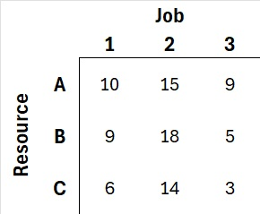
```

The first step, after initialization, involves row reduction operations (lines 4-6). Following completion of row reduction operations, the cost matrix appears as follows:

```{r, echo=FALSE, out.height="25%", out.width="25%", fig.align='center', fig.cap="Cost matrix after row reduction operations"}

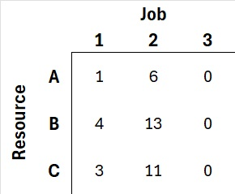
```

After row reduction operations, we perform similar reductions in a column-wise manner. The figure below shows the cost matrix after column reduction operations are complete.

```{r, echo=FALSE, out.height="25%", out.width="25%", fig.align='center', fig.cap="Cost matrix after column reduction operations"}
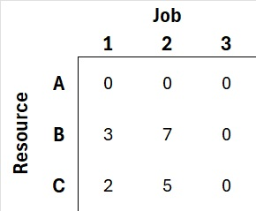
```
### Determining whether an optimal solution has been found

Next, we "cover" (i.e., draw lines covering) all $0$'s in the cost matrix. Specifically, we want to cover all $0$'s with the minimum number of horizontal and vertical lines. The figure below shows such a covering.

The algorithm is complete with an optimal solution found when the number of lines is equal to $n$. In the figure below, we see that two lines covers all $0$'s, so we have not yet found an optimal solution.

```{r, echo=FALSE, out.height="25%", out.width="25%", fig.align='center',, fig.cap="Cost matrix showing coverage lines - not optimal"}
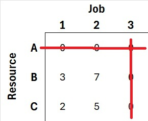
```

If the number of lines does not equal $n!$, we perform adjusting operations to further reduce the cost matrix. Specifically, we:

- Identify the minimum uncovered value, $k$, in the matrix
- Subtract $k$ from all uncovered values
- Add $k$ to covered instersection values (i.e., values at the intersection of horizontal and vertical lines).

The figure below shows the minimum uncovered value (circled in red) and the only covered intersection (circled in green).

```{r, echo=FALSE, out.height="25%", out.width="25%", fig.align='center', fig.cap="Cost matrix highlighting minimum uncovered value and intersections"}
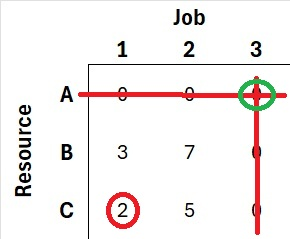
```
The figure below shows the cost matrix after completing the adjusting operations.

```{r, echo=FALSE, out.height="25%", out.width="25%", fig.align='center', fig.cap="Cost matrix after adjusting for uncovered values"}
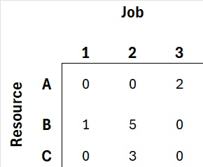
```

We once again draw the minimum number of horizontal and vertical lines to cover all $0$'s. At this point, as shown in the figure below, three lines covers all $0$'s; since $n = 3$, the matrix represents an optimal solution.

```{r, echo=FALSE, out.height="25%", out.width="25%", fig.align='center', fig.cap="Cost matrix showing coverage lines - optimal solution"}
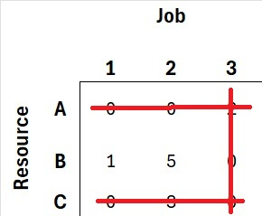
```

### Extracting the optimal solution

To find the optimal solution we start by looking for rows with a single $0$; a single $0$ identifies an optimal assignment. In the figure below, we see the row for resource B contains a single $0$ in column $3$. Therefore, we assign resource B to job $3$ and eliminate rows 2 and 3 from further consideration.

```{r, echo=FALSE, out.height="25%", out.width="25%", fig.align='center', fig.cap="Cost matrix showing single $0$ in row B"}

```


```{r, echo=FALSE, out.height="25%", out.width="25%", fig.align='center', fig.cap="Cost matrix showing after assigning resource B to job $3$"}
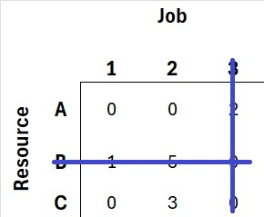
```

We continue identifying rows with a single $0$. This time, we see that row C contains a single $0$ in column 1. We therefore assign resource C to job $1$.

```{r, echo=FALSE, out.height="25%", out.width="25%", fig.align='center', fig.cap="Cost matrix showing after assigning resource C to job $1$"}
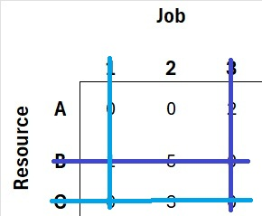
```

We continue in this fashion until all resources have been assigned a job. In this case, the final assignment is trival; A is the only unassigned resource and job 2 is the only remaining job. Thus assigning resource A to job 2 is the final assignment for this problem. The cost-minimizing set of assignments is:

$$\mathbf{x} = \{(B, 2), (C, 1), (A, 2)\}$$

The figure below shows the job costs associated with the optimal solution. Summing these yields the total cost of the solution:


```{r, echo=FALSE, out.height="25%", out.width="25%", fig.align='center', fig.cap="Cost matrix showing costs for optimal solution"}
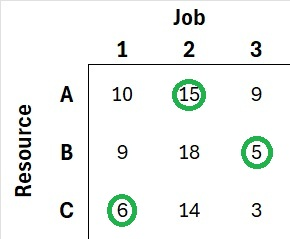
```

$$total\ cost = \sum_{ij \in \mathbf{x}} c_{ij} x_{ij}$$
Alternatively, each time we assign a resource to a job, we set $x_{ij}$ to 1. At the completion of the Algorithm 1, the matrix $\mathbf{x}$ appears as follows:

```{r, echo=FALSE, out.height="25%", out.width="25%", fig.align='center', fig.cap="Decision variable matrix  $\\mathbf{x}$"}
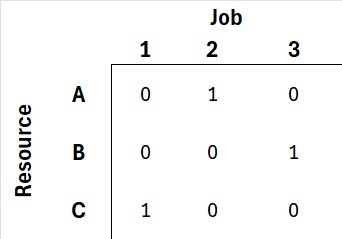
```

Using matrices $\mathbf{c}'$ and $\mathbf{x}$ we can calculate the optimal value:

$$total\ cost = \mathbf{c}' \cdot \mathbf{x} = \sum_{i\in\{A, B, C\}}\sum_{j=1}^n c_{ij} x_{ij}$$

