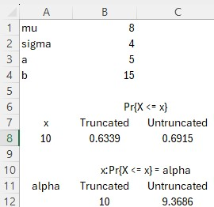
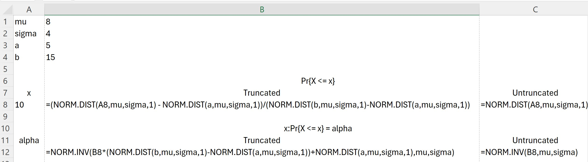

```{r setup, include=FALSE}
knitr::opts_chunk$set(echo = TRUE)
```

You've learned to work with a variety of distributions in Decision Modeling and other courses. For example, we've worked with Poisson, binomial, discrete uniform, normal (Guassian), exponential, continuous uniform, and shifted exponential distributions. You might have even worked with a beta distribution.

## Naturally bounded

Some distributions are inherently bounded, either above or below. For example, the exponential distribution is bounded below but unbounded above. The figure below illustrates an exponential distribution; that is, the figure shows the exponential density function (the curve) and the shaded area below the curve represents a cumulative probability. We see that the exponential distribution is bounded below at 0. In other words, $Pr\{X<=x\} = 0$ for any $x < 0$.

```{r, echo=FALSE}
cord.x <- c(0,seq(0, 15, 0.01), 15) 
cord.y <- c(0, dexp(seq(0, 15, 0.01),1/5), 0)
curve(dexp(x,1/5),0,30,
      xlim=c(0,30),
      ylab='f(x)',
      main='Exponential Density Function (with shaded probability)') 
polygon(cord.x,cord.y,col='lightblue')
text(15,.10,cex=1.5,expression(paste("Pr{",X <= 15,"}")))
```

While the exponential distribution is bound only below, the continuous uniform distribution is bounded below and above. For example, the continuous uniform distribution shown in the figure below is bounded below at 5 and above at 15. In other words, $Pr\{X<=5\} = 0$ and $Pr\{X>15\} = 0$.

```{r, echo=FALSE}
a<-5
b<-15
cord.x <- c(5,seq(5, 12, 0.01), 12) 
cord.y <- c(0, dunif(seq(5, 12, 0.01),a, b), 0)
curve(dunif(x,a, b),5,15,
      xlim=c(0,20),
      ylim=c(0,0.15),
      ylab='f(x)',
      main='Continuous Uniform Density Function (with shaded probability)\na = 5, b = 15') 

polygon(cord.x,cord.y,col='lightblue', border="black")
lines(c(0,20),c(0,0))
lines(c(15,15),c(0,dunif(10,a,b)))
text(10,.125,cex=1.5,expression(paste("Pr{",X <= 12,"}")))

```


## Unbounded distributions

Many of us automatically think of the normal distribution when we think of probability distributions. It may be the first distribution you learned. Unless you have taken a lot of OTM courses (or advanced probability/stochastic processes courses), it may be the *only* distribution you're familiar with. Nearly everyone has used the normal distribution to calculate confidence intervals and most (if not all of us) learned about hypothesis testing using the normal distribution. Moreover, in the real world, *many* natural phenomenon can be described using normal distributions.

The normal distribution is naturally unbounded. For example, the normal distribution shown in the figure below has mean 8 and standard deviation 4. The shaded area shows the cumulative probability of $X \leq 10$. The distribution is unbounded above and below.

```{r, echo=FALSE}
cord.x <- c(-4,seq(-8,10,0.01), 10) 
cord.y <- c(0, dnorm(seq(-8,10,0.01), 8, 4), 0) 
curve(dnorm(x,8,4),
      xlim=c(-8,24),
      ylab=expression(f(x)),
      main='Standard Normal Density Function (with shaded probability)') 
polygon(cord.x,cord.y,col='lightblue')
text(6.4,.04,cex=1.5,expression(paste("Pr{",X <= 10,"}")))

```

## When unbounded is a problem

However, consider that the normal distribution shown above is supposed to represent the duration of a task in days. It is clear that there is some non-zero probability that the task's duration is less than 0; in fact, $Pr\{X \leq 0\} = `r round(pnorm(0, 8,4),4)`$. In other words, there's a 2.3% chance that the task's duration is *negative*. I don't even know what *that*, negative time, would mean!

The problem isn't just that a task's duration can't be negative, there's a practical minimum to a task's duration. Specifically, there's a practical lower limit on a task's work content and therefore, because duration is given by

$$t = \frac{w}{R}$$
where $w$ is the task's work content (i.e., the time it would take one average resource to complete the task) and $R$ is the number of full time resources assigned to the task.

Now, sticking with *duration* for our example, *what if we determined that the mininum duration for the task is 4*? In fact, we might also decide that there is a practical upper bound on how long the task could take.

## Truncated distributions

When a distribution is naturally bounded, we don't consider it a *truncated* distribution for the purpose of this discussion, because the bounds are already baked into to the distribution (e.g., the continous uniform distribution has lower bound $a$ and upper bound $b$ by definition). However, we can *truncate* (i.e., bound) *any* distribution. For unbounded distributions, this means imposing bounds. For an already bounded distribution, this means imposing *tighter* bounds (e.g., adding an upper bound to an exponential distribution which is already bounded below). 

Let's assume that our task's duration is bounded at 5 below and 15 above. The distribution would appear as in the following figure:

```{r, echo=FALSE}
cord.x <- c(5,seq(5, 15, 0.01), 15) 
cord.y <- c(0, dnorm(seq(5, 15, 0.01), 8, 4), 0) 
curve(dnorm(x,8,4),
      xlim=c(-8,24),
      ylab=expression(f(x)),
      main='Truncated Normal Distribution (with bounds 5 and 15)',
      sub='Shading shows area between lower and upper bounds') 
polygon(cord.x,cord.y,col='lightblue')
# text(6.4,.04,cex=1.5,expression(paste("Pr{",X <= 10,"}")))

```

In *this* case, if we try to calculate any probabilities (cumulative or inverse cumulative) using an untruncated normal distribution with mean 8 and standard deviation 4, our results would be incorrect (and potentially very significantly incorrect).

Why is this? Well, the normal distribution is naturally unbounded. The shaded area in the figure above represents the entire valid range of the truncated normal with bounds [5, 15], but the untruncated normal distribution encompasses the entire area under the probability density function. To find the *correct* probabilities, we must *adjust* the values we calculate for an untruncated normal distribution to account for the boundaries (i.e., to account for the reduced domain).


## Calculating cumulative probabilities for any truncated distribution

So how do we do adjust for the boundaries? Let's assume the following notation:

$$F(X) = Pr\{X\leq x\}$$
$$F^{-1}(\alpha)=x:Pr\{X\leq x\}=\alpha$$
so that $F(x)$ represents the cumlulative distribution function (i.e., cumulative probability, CDF) and $F^{-1}(\alpha)$ is the inverse cumulative probability function for random variable $X$. Then, in general, to calculate $F_{a,b}(x)$, the cumulative probability for a truncated distribution with lower bound $a$ and upper bound $b$, we would do the following:

$$F_{a,b}(x) = \frac{F(x) - F(a)}{F(b)-F(a)}$$
Tecnhnically, we also need to ensure that $F_{a,b}(x) = 0$ when $x \leq a$ and $F_{a,b}(x) = 1$ when $x \geq b$. So, the most accurate way to express this is:

$$F_{a,b}(x) = \left\{ 
  \begin{array}{ c l }
    0 & x \leq a \\
    \frac{F(x) - F(a)}{F(b)-F(a)} & a < x \leq b  \\
    1                 & x > b
  \end{array}
\right.$$


However, as long as we ensure that $a \leq x \leq b$, we can simply use the original expression and avoid the complexity of the conditional.

### Imposing only a lower or upper bound

If we have only a lower bound (i.e., the distribution is unbounded above), this becomes the following:

$$F_{a,\infty}(x) = \frac{F(x) - F(a)}{F(\infty)-F(a)}= \frac{F(x) - F(a)}{1-F(a)}.$$

Similarly, if the distribution has only an upper bound, this would simply to:

$$F_{-\infty,b}(x) = \frac{F(x) - F(-\infty)}{F(b)-F(-\infty)} = \frac{F(x) - 0}{F(b)-0} =\frac{F(x)}{F(b)}.$$
Here, we've shown the natural lower bound as $-\infty$, since our example problem focused on the normal distribution. However, the same concept applies to a distribution with a natural lower bound not equal to $-\infty$. For example, the lower bound for the exponential distribution is 0. So, for an exponential distribution, we'd write:

$$F_{0,b}(x) = \frac{F(x) - F(0)}{F(b)-F(0)} = \frac{F(x) - 0}{F(b)-0} =\frac{F(x)}{F(b)}.$$

Now, returning to our example problem, let's find $Pr\{X \leq 10\}$ for our truncated normal distribution with lower bound 5, and upper bound 15. Substituting our problems values into the expression above, we have:

$$F_{5,15}(10) = \frac{F(10) - F(5)}{F(15)-F(5)}$$
As long as we can calculate $F(x)$ for a distribution, we can calculate $F_{a,b}(x)$!

### Calculating inverse cumulative probabilities

This will look a bit more involved, but it's the same basic concept applied to calculating the inverse cumulative probability. We start with:

$$F_{a,b}(x) = \frac{F(x) - F(a)}{F(b)-F(a)}$$
To find the inverse cumulative probability, we first must isolate $F(x)$. We start by multiply through by the RHS denominator, to eliminate the quotient:

$$F_{a,b}(x)\big[F(b)-F(a)\big] = F(x) - F(a)$$
Next, we add $F(a)$ to both sides, isolating $F(x)$:

$$F_{a,b}(x)\big[F(b)-F(a)\big] + F(a) = F(x)$$
So

$$F(x) = F_{a,b}(x)\big[F(b)-F(a)\big] + F(a)$$
Now we have isolated $F(x)$, but we really want $x$, so we calculate the inverse cumulative probabity of both sides:

$$F^{-1}\big(F(x)\big) = F^{-1}\big(F_{a,b}(x)\big[F(b)-F(a)\big] + F(a)\big)$$
or

$$x = F^{-1}\big(F_{a,b}(x)\big[F(b)-F(a)\big] + F(a)\big).$$

Note that in this expression, $F_{a,b}(x)$ represents the cumulative probability for which we are trying to find the corresponding inverse. It may be easier to think of it as $\alpha$, to emphasize it is a given probability for which we are calculating the inverse. Restating the expression above in terms of $\alpha$ yields:

$$x = F^{-1}\big(\alpha \big[F(b)-F(a)\big] + F(a)\big).$$

And as before, when we have only a lower bound, this becomes:

$$x = F^{-1}\big(\alpha(\big[F(\infty)-F(a)\big] + F(a)\big)$$

$$x = F^{-1}\big(\alpha\big[1-F(a)\big] + F(a)\big).$$
If we have only an upper bound, this becomes:

$$x = F^{-1}\big(\alpha\big[F(b)-F(-\infty)\big] + F(-\infty)\big)$$
which simplifies to:

$$x = F^{-1}\big(\alpha\big[F(b)-0\big] + 0\big) = F^{-1}\big(\alpha F(b)\big)$$

## Calculating truncated probabilities using Excel

Let's see how we can use our general methods for calculating truncated cumulative and inverse cumulative probabilities using Excel. We'll start with our motivating example where we want to calculate $Pr\{X\leq 10\}$ for a truncated normal distribution with $\mu=8$, $\sigma = 4$, and boundaries $a = 5$ and $b = 15$.

For a normal distribution, $F(x)$ is calculated using $norm.dist(x,\mu,\sigma,1)$ in Excel (you can also specify *True* for the fourth argument), and $F^{-1}(\alpha)$ is calculated using $norm.inv(\alpha, \mu, \sigma)$.

So, to calculate $Pr\{X \leq 10\} = F_{5,15}(10)$, we use our general expression from above:

$$F_{a,b}(x) = \frac{F(x) - F(a)}{F(b)-F(a)}$$
substituting $a=5$, $b=15$, and $x=10$:

$$F_{5,15}(10) = \frac{F(10) - F(5)}{F(15)-F(5)}$$
To construct our Excel formula, we replace every $F(x)$ with a call to $norm.dist$:

$$=\bigl( norm.dist(10, 8, 4, 1) - norm.dist(5, 8, 4, 1) \bigr) / \bigl( norm.dist(15, 8, 4, 1) - norm.dist(5, 8, 4, 1) \bigr)$$

Let's say we want to *generate* a random duration for a task whose duration is given by a truncated normal distribution with $\mu = 40$, $\sigma = 15$, and $a = 10$ (i.e., it is bounded below and unbounded above). Using the inverse transform method, we want to calculate:

$$t = F_{10,\infty}^{-1}(U),\quad U\sim Unif[0,1]$$
Using the expression we found previously when we have only a lower bound

$$x = F^{-1}\big(\alpha\big[1-F(a)\big] + F(a)\big).$$
and substituting the values for our problem:

$$x = F^{-1}\big(U\big[1-F(10)\big] + F(10)\big)$$
which corresponds to the following Excel formula

$$=norm.inv\bigl( rand() * (1 - norm.inv(10, 40, 15)) + norm.inv(10, 40, 15) \bigr)$$

### Example shown in Excel

For some, seeing the above actually in Excel may help. The figure below shows the parameters of our truncated distribution and the results of our calculations. The *Truncated* column contains results that were correctly calculated using the truncated distribution. The *Untruncated* column contains results that were calculated just using the usual built-in Excel functions without adjusting for the bounds.



And below you can see the formulas for the spreadsheet shown above:




