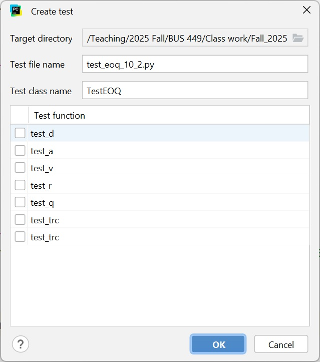

  
```{r setup, include=FALSE}
knitr::opts_chunk$set(echo = TRUE)

suppressMessages(library(reticulate))
```

In this tutorial, we're going to look at structured unit testing using the UnitTest framework:

- Designing tests
- Configuring PyCharm to run unit tests (review)
- Writing unit tests with the "unit test" framework.

UnitTest is one of many testing frameworks. Arguably, it is the easiest to use (the reason we're using it), and it was designed to work like the popular JUnit test framework for Java programs. There are other, more extensive, test frameworks available, but UnitTest serves our purpose and provides an easy introduction to structured testing with a testing framework.

Note: In most of the coding examples, I have intentionally omitted docstrings, just to keep the code compact. *ALL* of your functions, classes, and methods should provide docstrings.


## Designing tests

Actually, we already discussed designing tests in class, so there's no need to repeat the conceptual stuff. We also demonstrated how to configure the default test runner and to run execution tests in PyCharm. Please refer to the class recording and/or class notes for more information.

Having said that, each testing framework provides its own structure for constructing tests. UnitTest is designed around the following:

### Test Fixture

A test fixture represents the preparation needed to perform one or more tests, and any associated cleanup actions. This may involve, for example, creating temporary or proxy databases, directories, or starting a server process.

### Test Case

A test case is the individual unit of testing. It checks for a specific response to a particular set of inputs. unittest provides a base class, TestCase, which may be used to create new test cases.

### Test Suite

A test suite is a collection of test cases, test suites, or both. It is used to aggregate tests that should be executed together.

### Test Runner
A test runner is a component which orchestrates the execution of tests and provides the outcome to the user. The runner may use a graphical interface, a textual interface, or return a special value to indicate the results of executing the tests.
      

## Writing unit tests with the "unit test" framework

Testing frameworks are designed to make writing tests more efficient. There are a number of different testing frameworks available for testing in Python (Pytest is another popular testing framework).

The ideal way to approach your testing is as follows:

- Design your code, including all method call and return signatures (so you know what functions require and return)

- Write your unit tests (based on your design and **before you've written any of your actual code**)

- Iteratively code and test (using your unit tests) portions of your code. When you pass all of your tests, your coding is complete.

### Test Fixtures and Test Cases

A test case is *an individual unit of testing*. Test cases may contain multiple *test methods*. Think of a test case as the big picture relating to testing a piece of code, and test methods as the detailed/low-level tests that make up the test case.

In the unittest framework, we create a *test case* by defining a class, subclassing the unittest class TestCase. Within a test case, we can define setUp and tearDown methods. These are useful when we have initialization that we want to take place *before each test method executes*, or cleanup code that we want to run *after each test method executes*. Use of setUp and tearDown can help ensure that every test method experiences a clean (and known) environment.

The unittest framework also allows for test suites and test fixtures. However, for our purposes (and to keep things simple), we need only use test cases and test methods at this time.

The easiest way to create a new test case is to:

1.  place your cursor (anywhere) on the line where your class or function is defined
1.  launch the context menu (<alt><ins> or right-click|Generate on Windows)
1.  Select test
1.  Confirm/change the filename (when creating your tests for assignments, be sure to name your test files so they will not conflict with the execution test files I provide)
1.  Make any other changes you like and confirm.

PyCharm will create a new file containing a skeleton test case (i.e., a new class derived from TestCase). Now you can add as many test methods as you like.

For OOP, it's best to define your test cases for your classes, and add one or more methods under the test case to test each property/method for the class being tested. Remember, *everything* should be tested, even simple getter properties.

### Example

Let's define an EOQ class and generate unittests for it.

```{python}
class EOQException(Exception):

    def __init__(self, D, A, v, r):
        super().__init__()
        self.D = D
        self.A = A
        self.v = v
        self.r = r

    def __str__(self):
        msg = f'One or more of the calling arguments was invalid:\n{self.D=}\n{self.A=}\n{self.v=}\n{self.r=}\n{super().__str__()}'
        return msg


class EOQ:
    """
    State preserving economic order quantity (EOQ) class. The EOQ is the cost-minimizing order
    quantity under the following assumptions:
        - Demand is deterministic, constant, and stationary
        - Inventory related costs consist of a holding cost per unit (assessed on average inventory) and an
        - aggregate order placement cost (i.e., a flat fee to place an order regardless of the quantity ordered).
    """

    def __init__(self, d: int|float, a: int|float, v: int|float, r: float):
        """
        Creates an Economic Order Quantity (EOQ) object.
        :param d: Demand in units (usually annual demand)
        :type d: float
        :param a: Aggregate order placement cost.
        :type a: float
        :param v: unit acquisition cost (same currency units as order placement cost)
        :type v: float
        :param r: unit holding cost percentage rate (time units must match demand time units, e.g. annual)
        :type r: float

        Raises an EOQException if any of D, A, v, and r are invalid (i.e., non-numeric or
        non-positive).
        """

        # validate arguments. d, a, v, and r must all be numeric and positive
        args = [d, a, v, r]

        # create boolean list of argument validity
        test = [isinstance(a, Number) and a > 0 for a in args]

        if all(test):
            # all arguments are valid, so we can calculate the EOQ, so save private attributes

            self._d = d
            self._a = a
            self._v = v
            self._r = r

        else:
            # At least one calling argument was non-numeric or non-positive, so return None indicating that no
            # result could be calculated.
            raise EOQException(d, a, v, r)


    @property
    def d(self):
        return self._d

    @property
    def a(self):
        return self._a

    @property
    def v(self):
        return self._v

    @property
    def r(self):
        return self._r

    @property
    def q(self):
        """
        Calculates the EOQ for the object's normal state: D, A, v, and r.

        Returns:
            (float): Economic order quantity
        """

        return math.sqrt(2 * self.d * self.a / (self.v * self.r))

    @property
    def trc(self):
        """
        Calculates Total Relevant Cost corresponding to the EOQ, i.e., TRC(Q*), for the object.

        Returns:
            (float): Total relevant cost (TRC) for the object's normal state.
        """

        return math.sqrt(2 * self.d * self.a * self.v * self.r)

    def trc_q(self, q: int|float=None):
        """
        Calculates the total relevant cost (TRC) for quantity q. If no q is specified,
        returns TRC(Q*).
        
        Args:
            q (int|float):

        Returns:
            (float): Total relevant cost of q.
            None: if q is non-numeric or non-positive.
        """
        
        if q is None:
            return self.trc
        
        if isinstance(q, Number) and q > 0:
            # q is valid, so use the general form of the TRC to calculate for q
            return q * self.v * self.r / 2 + self.d * self.a / q
        else:
            # q is invalid
            return None

```

The dialog that appears when we invoke generate (with the curse placed in the *class EOQ:* line appears as follows:

```{r echo=FALSE, out.width = "35%", fig.align = "center"}


```

Click all of the checkboxes, click OK, and PyCharm will generate the following code:

```{python, eval=FALSE}
from unittest import TestCase


class TestEOQ(TestCase):
    def test_d(self):
        self.fail()

    def test_a(self):
        self.fail()

    def test_v(self):
        self.fail()

    def test_r(self):
        self.fail()

    def test_q(self):
        self.fail()

    def test_trc(self):
        self.fail()

    def test_trc(self):
        self.fail()
```

OK, so we still have to write all of the actual testing code, but at least PyCharm created the basic skeleton for us; we have one method for each property/method of our EOQ class. From here, we can easily rename and/or create additional testing methods.

The first step is to import our EOQ and EOQException classes; we add the following line to our imports section:

```{python, eval=FALSE}
from eoq_10_2 import EOQ, EOQException

```

Now we're ready to go. Notice that no setUp or tearDown methods have been added by default. Let's add a setUp method which will create a *valid* EOQ object. There's no need for a tearDown method in this case since we don't have any files or other resources to close.

While we're at it, let's fill in the *generated *test methods.

```{python, eval=FALSE}
import math
from unittest import TestCase, main
from eoq_10_2 import EOQ, EOQException


class TestEOQ(TestCase):

    def setUp(self):
        self.eoq = EOQ(10000, 500, 12.95, 0.35)

    def test_d(self):
        self.assertAlmostEqual(10000, self.eoq.d)

    def test_a(self):
        self.assertAlmostEqual(500, self.eoq.a)

    def test_v(self):
        self.assertAlmostEqual(12.95, self.eoq.v)

    def test_r(self):
        self.assertAlmostEqual(0.35, self.eoq.r)

    def test_q(self):
        exp = math.sqrt(2 * self.eoq.d * self.eoq.a / (self.eoq.v * self.eoq.r))
        self.assertAlmostEqual(exp, self.eoq.q)

    def test_trc(self):
        exp = math.sqrt(2 * self.eoq.d * self.eoq.a * self.eoq.v + self.eoq.r)
        self.assertAlmostEqual(exp, self.eoq.trc)

    def test_trc_q(self):
        q = 500
        exp = q * self.eoq.v * self.eoq.r / 2 + self.eoq.d * self.eoq.a / q
        self.assertAlmostEqual(exp, self.eoq.trc_q(q))
        
if __name__ == '__main__':
    main(verbosity=2)

```

Note that so far we have only included tests for *valid* EOQ instances. For our tests to be sufficient, we must also include tests for *invalid* cases. For example, we might add the following method to our test class:


```{python, eval=FALSE}

    def test_invalid(self):
        # test 0's - these test cases are complete (i.e., all possibilities covered)
        self.assertRaises(EOQException, EOQ, 0, 500, 12.95, 0.35)
        self.assertRaises(EOQException, EOQ, 10000, 0, 12.95, 0.35)
        self.assertRaises(EOQException, EOQ, 10000, 500, 0, 0.35)
        self.assertRaises(EOQException, EOQ, 10000, 500, 12.95, 0)
        self.assertRaises(EOQException, EOQ, 0, 0, 12.95, 0.35)
        self.assertRaises(EOQException, EOQ, 0, 500, 0, 0.35)
        self.assertRaises(EOQException, EOQ, 0, 500, 12.95, 0)
        self.assertRaises(EOQException, EOQ, 10000, 0, 0, 0.35)
        self.assertRaises(EOQException, EOQ, 10000, 0, 12.95, 0)
        self.assertRaises(EOQException, EOQ, 10000, 500, 0, 0)
        self.assertRaises(EOQException, EOQ, 0, 0, 0, 0.35)
        self.assertRaises(EOQException, EOQ, 0, 0, 12.95, 0)
        self.assertRaises(EOQException, EOQ, 0, 500, 0, 0)
        self.assertRaises(EOQException, EOQ, 1000, 0, 0, 0)
        self.assertRaises(EOQException, EOQ, 0, 0, 0, 0)

        # test negatives - these are incomplete, having only tested single negative arguments
        self.assertRaises(EOQException, EOQ, -10000, 500, 12.95, 0.35)
        self.assertRaises(EOQException, EOQ, 10000, -500, 12.95, 0.35)
        self.assertRaises(EOQException, EOQ, 10000, 500, -12.95, 0.35)
        self.assertRaises(EOQException, EOQ, 10000, 500, 12.95, -0.35)

        #TODO Complete the tests for various combinations of negative arguments

```

I generally include an instantiation test as well, that verifies that the values are stored in the correct private member variables. Here's an example. Notice that in *these* tests, I compare the expected values to the private attributes (rather than to their getter properties).

```{python, eval=FALSE}

    def test_init(self):
        # verify that values are where they should be
        self.assertAlmostEqual(10000, self.eoq._d)
        self.assertAlmostEqual(500, self.eoq._a)
        self.assertAlmostEqual(12.95, self.eoq._v)
        self.assertAlmostEqual(0.35, self.eoq._r)

```

### Asserts

The unittests framework provides a large number of asserts. It would be a good idea to review the list of asserts so that you have a sense of what is available (the examples above used only assertAlmostEqual to compare floating point values). You can find [descriptions of the available asserts](https://docs.python.org/3/library/unittest.html) [here](https://docs.python.org/3/library/unittest.html). You'll have to scroll down (the asserts start about one-third of the way down the page).

### But wait, there's more

There's a lot more to unittest, but it would be overwhelming to attempt to cover it all at this point. The basics outlined here are sufficient for you to test anything you will be doing in this course. You might want to check out *subtests* (you'll see them used frequently in the execution tests I provide), which can make it much easier to identify which test cases are failing, when you testing is being performed in a loop. You can also find (information on subtests)[https://docs.python.org/3/library/unittest.html] in the unittest documentation.


